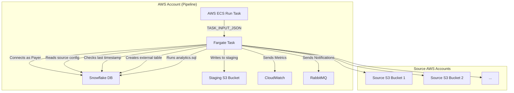

# Fargate Data Copy & Snowflake Processing Pipeline

This project implements a scalable, resilient, and environment-aware data pipeline using AWS Fargate and Snowflake. Its primary function is to copy CUR (Cost and Usage Report) data from multiple S3 buckets, stage it centrally, and then execute analytics on that data using Snowflake.

---

## Table of Contents

1. [Overview & Core Functionality](#1-overview--core-functionality)
2. [High-Level Architecture Diagram](#2-high-level-architecture-diagram)
3. [Data Flow & Execution Logic](#3-data-flow--execution-logic)
4. [Key Features](#4-key-features)
5. [Project Structure](#5-project-structure)
6. [Configuration](#6-configuration)
7. [How to Run the Fargate Task](#7-how-to-run-the-fargate-task)
8. [Error Handling & Resilience](#8-error-handling--resilience)
9. [Dependencies](#9-dependencies)

---

## 1. Overview & Core Functionality

The pipeline automates:

* Synchronizing CUR data from multiple AWS accounts into a central S3 bucket
* Dynamically creating Snowflake external tables
* Executing complex analytics scripts in Snowflake

This is deployed via Docker on AWS Fargate, and is executed manually or on schedule. It's environment-aware and uses Snowflake as the central processing engine.

### Core Steps:

1. **Ingest Parameters**: via `TASK_INPUT_JSON`
2. **Load Configs**: from Snowflake or fallback config
3. **Discover Files**: identify new or modified Parquet files
4. **Stage Files**: copy to central S3 staging bucket
5. **Create External Table**: in Snowflake
6. **Run Analytics**: execute SQL script
7. **Log Status**: metrics sent to CloudWatch and RabbitMQ

---

## 2. High-Level Architecture Diagram



---

## 3. Data Flow & Execution Logic

### 1. Initialization (`main.py`)

* Reads and validates `TASK_INPUT_JSON`
* Loads environment config via `get_environment_config()`
* Initializes `FargateDataCopyService`

### 2. Config Loading (`s3_client.py`)

* Connects to Snowflake table `aws_az_share.metadata.pro_refresh_config`
* If Snowflake fails, uses hardcoded fallback config

### 3. Incremental Discovery (`data_copy_service.py`)

* Retrieves last processed timestamp from Snowflake
* Lists new files in source S3 based on `LastModified`
* Skips payers with no new data

### 4. S3 Data Copy

* Parallel S3 copy via `ThreadPoolExecutor`
* Destination format: `year=YYYY/month=MM/payer-ACCOUNTID/`

### 5. Snowflake External Table Creation (`snowflake_external_table.py`)

* Uses INFER\_SCHEMA to adapt to changes
* Creates external table pointing to staged data

### 6. Run Analytics SQL (`analytics_wastage_queries.sql`)

* Injects `year`, `month`, `payers_ids`
* Executes via `execute_string()`
* Errors here are non-fatal if data was copied successfully

---

## 4. Key Features

* **Environment-aware**: switch logic based on `env`
* **Dynamic config loading**: via Snowflake or fallback
* **Incremental sync**: only fetches new files
* **Late-arriving data support**: scans current & previous months
* **Schema flexibility**: adapts using `INFER_SCHEMA`
* **Parallel S3 copy**: boosts performance
* **Resilient SQL handling**: logs errors without crashing
* **Integrated monitoring**: CloudWatch + RabbitMQ

---

## 5. Project Structure

```text
.
├── Dockerfile                      # Container definition
├── README.md                       # This file
├── analytics_wastage_queries.sql  # Business logic SQL
├── config.py                       # Environment & default config
├── cloudwatch_utils.py            # CloudWatch metrics
├── data_copy_service.py           # Main S3 copy logic
├── input_validator.py             # Input validation
├── main.py                         # Entry point for Fargate
├── rabbitmq_client.py             # RabbitMQ notifier
├── requirements.txt               # Python packages
├── s3_client.py                   # S3 + config manager
└── snowflake_external_table.py    # Snowflake interaction
```

---

## 6. Configuration

* `config.py`:

  * `PROD_STAGING_BUCKET`, `NON_PROD_STAGING_BUCKET`
  * `VHOST_MAPPING`, region settings, default Snowflake credentials
* `analytics_wastage_queries.sql`:

  * Contains placeholders: `#startyear`, `#startmonth`, `(#payers_ids)`
* Secrets Manager (in prod): used for secure Snowflake credentials

---

## 7. How to Run the Fargate Task

### Production Example

```bash
aws ecs run-task \
  --cluster aws_az_analytics_operations_cluster_prod1 \
  --task-definition aws_az_analytics_operations_td_PROD:2 \
  --launch-type FARGATE \
  --platform-version 1.4.0 \
  --region us-east-1 \
  --network-configuration "awsvpcConfiguration={subnets=[subnet-06b8915f632f8f383],securityGroups=[sg-026cc505e234ac970],assignPublicIp=ENABLED}" \
  --started-by "manual-run-for-july-data" \
  --overrides '... TASK_INPUT_JSON for prod ...'
```

### Non-Production Example

```bash
aws ecs run-task \
  --cluster aws_az_analytics_operations_cluster \
  --task-definition aws_az_analytics_operations_td:32 \
  --launch-type FARGATE \
  --platform-version 1.4.0 \
  --region us-east-2 \
  --network-configuration "awsvpcConfiguration={subnets=[subnet-0abfaa8f46ae6edab],securityGroups=[sg-05540ff3d6cf23b1e],assignPublicIp=ENABLED}" \
  --started-by "manual-run-for-july-data-dev" \
  --overrides '... TASK_INPUT_JSON for dev ...'
```

---

## 8. Error Handling & Resilience

* **Fatal Errors**:

  * Caught in `main.py`
  * Logged + CloudWatch metric sent
* **Snowflake Config Fallback**:

  * If query fails, uses local hardcoded `PAYER_CONFIGS`
* **S3 Access Fallback**:

  * Cross-account failures handled gracefully
* **SQL Errors**:

  * Wrapped in try/except
  * Logged but do not halt the pipeline
* **RabbitMQ Notifications**:

  * Includes retry logic with exponential backoff

---

## 9. Dependencies

Listed in `requirements.txt`. Key packages:

* `boto3`: AWS SDK (S3, ECS, CloudWatch, Secrets)
* `snowflake-connector-python`: for querying Snowflake
* `pika`: RabbitMQ messaging
* `python-dateutil`: for date/time utilities

---

